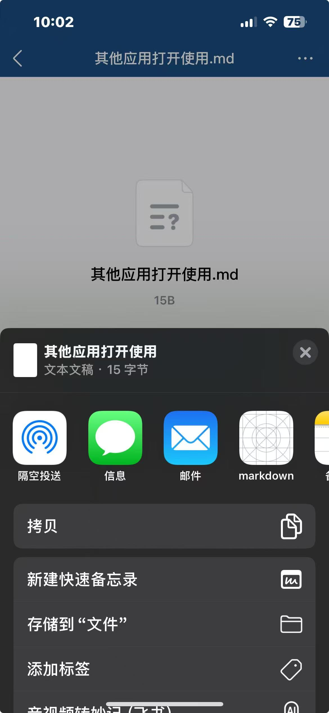
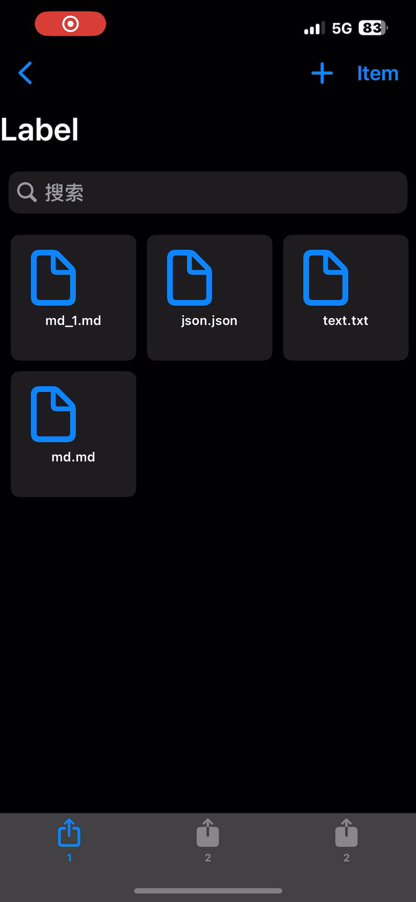
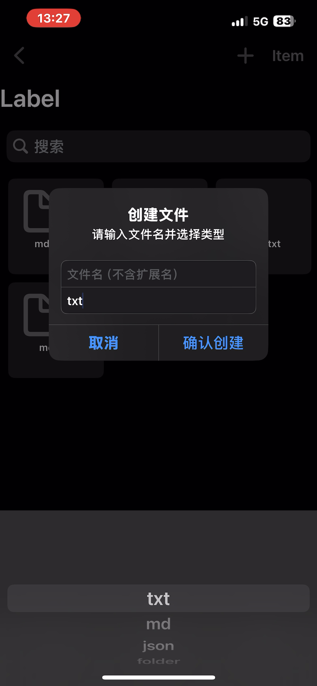
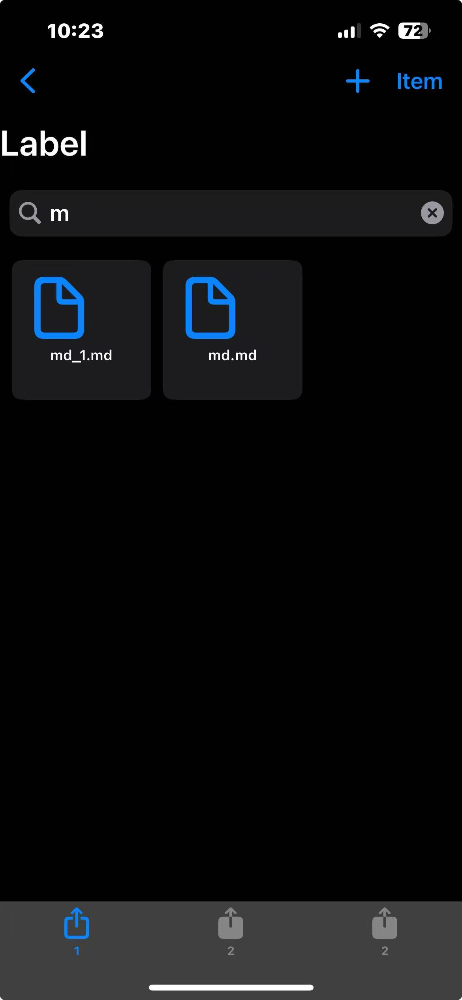
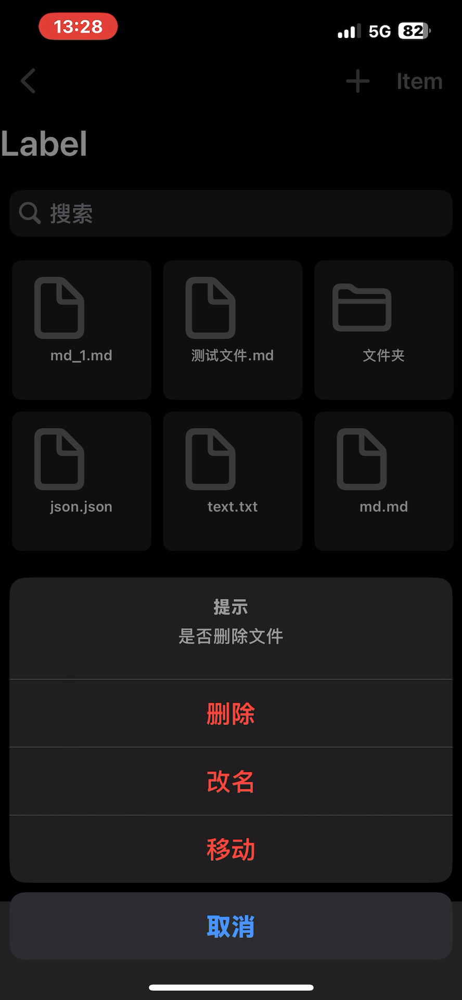
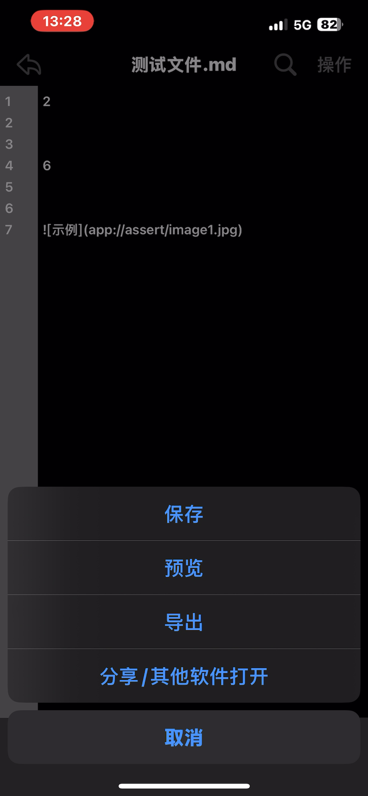
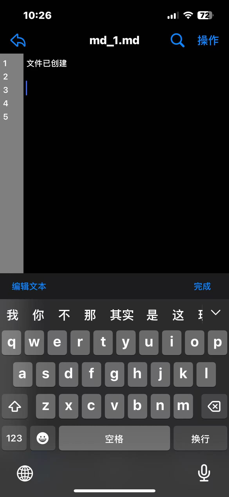
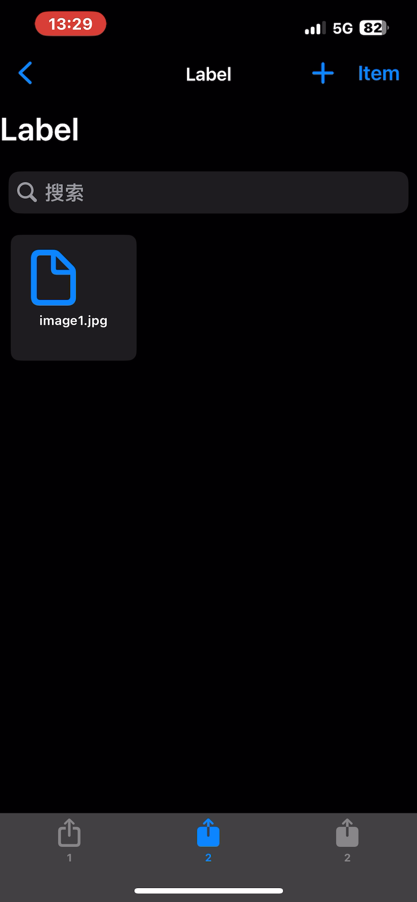
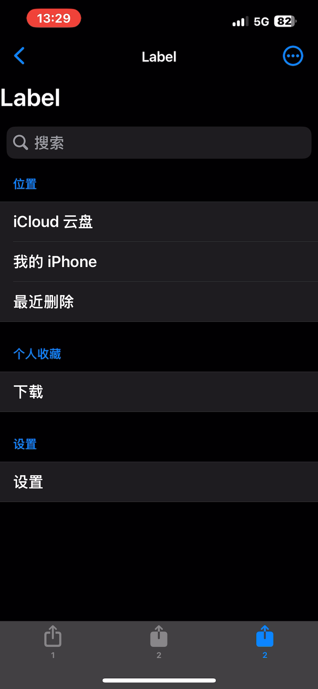
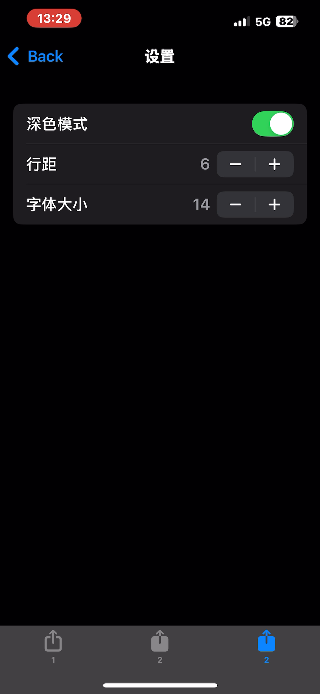

## 操作演示

### 操作视频

### 操作详细
##### 1.启动
启动方法:
- 1.可以从xcode正常运行
- 2.也可以通过其他应用打开

##### 2.文本文件

文件创建，文件夹创建，文件搜索功能
- 文本文件列表
    软件目前支持文件类型：txt、json、md，可以通过**文件导出**或**外部文件导入**查看html、pdf、docx
    文件列表的界面的功能有：搜索、创建文件或文件夹、点击文件夹进行查看

- 文件和文件夹创建
    点击右上角的"+"即可使用

- 搜索功能
    在搜索框输入，即可匹配。想要恢复正常，只需要设置为空即可

- 文件和文件夹改名、删除
    长按目标文件或文件夹

- 文件查看、修改、保存，图片插入，导出文件
    点击文件，进入界面

    点击文本即可弹出键盘

    通过键盘上方一栏左侧按钮切换快速编辑文本功能，有粘贴、复制、插入图片
    并且可以再次点击切换回去

##### 3.图片文件
- 图片文件列表
    可以创建文件夹和导入图片，但暂时没有删除和移动功能

- 图片导入
    跳转到相册部分，选择要导入的图片，并进行命名

##### 4.设置界面
- 其他功能界面
    目前只实现了设置功能

- 设置界面
    可以控制深浅色、字体大小、行距，修改完，再次进入文件编辑界面可以看到

